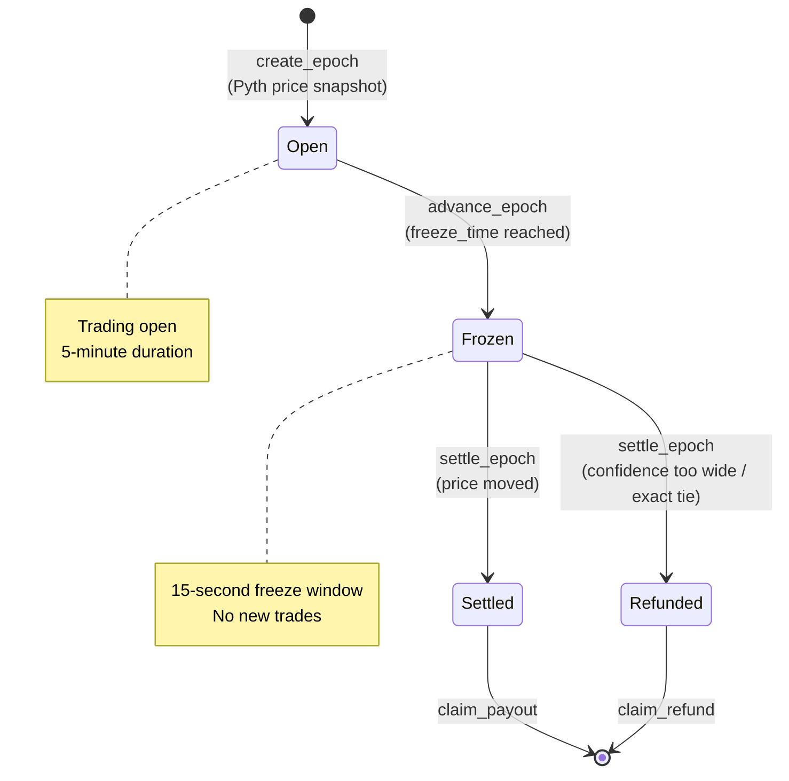
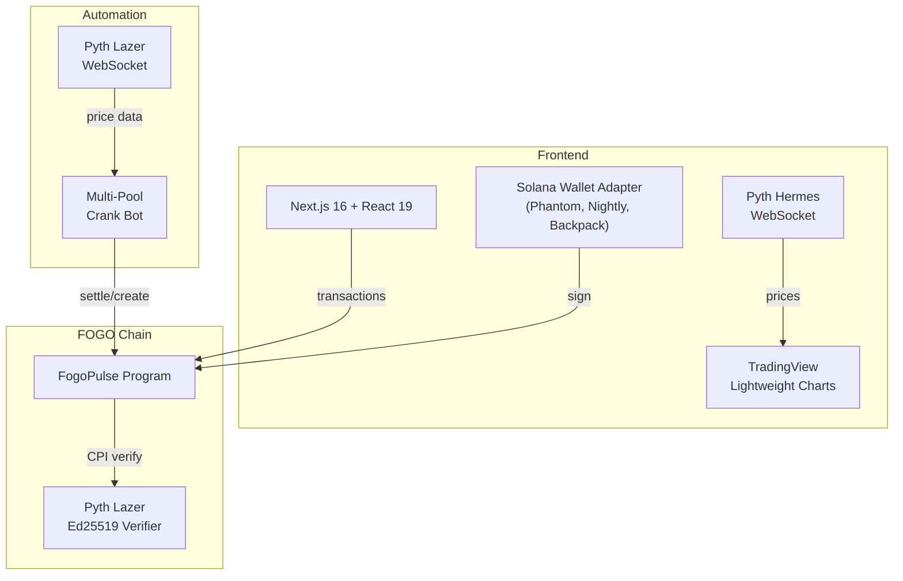
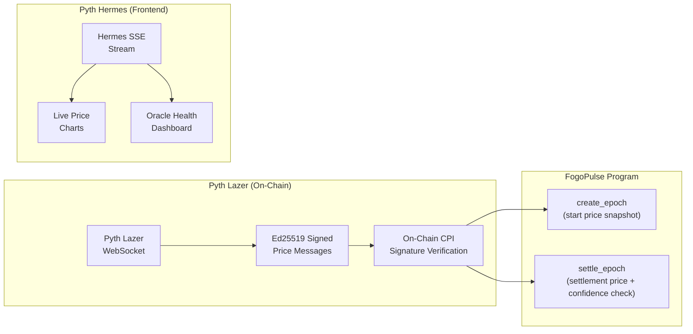

# FogoPulse

**Predict crypto prices. Win in minutes.**

Short-duration binary prediction markets on [FOGO chain](https://fogo.io) with trust-first settlement powered by [Pyth Network](https://pyth.network) oracles. Pick a market. Choose UP or DOWN. The oracle settles it in 5 minutes -- but only when the data is trustworthy.

---

## What Makes This Different

- **Pyth-Powered Confidence-Aware Settlement** -- Most prediction markets blindly trust the oracle price. FogoPulse uses Pyth's confidence intervals to detect when price data is uncertain and automatically refunds all participants. No forced losers on ambiguous data.
- **Dual Pyth Oracle Architecture** -- Pyth Lazer for cryptographically verified on-chain settlement (Ed25519). Pyth Hermes for sub-second real-time price streaming to the UI. Two oracle products, one seamless experience.
- **5-Minute Epochs** -- Fast-paced trading rounds that settle automatically. No waiting days or weeks.
- **CPMM-Based Pricing** -- Constant-product market maker sets fair prices dynamically. No bookmaker, no house edge.
- **Early Exit** -- Sell your position before settlement if you change your mind. The AMM gives you a fair exit price.
- **Liquidity Provision** -- Deposit USDC, earn trading fees. Single-token deposits with auto 50/50 split and share-based accounting.

---

## How It Works

Users predict whether a crypto asset's price will go UP or DOWN over a 5-minute epoch. Positions are priced via a constant-product AMM. When time's up, the Pyth oracle determines the outcome.

1. **Pick your market** -- BTC, ETH, SOL, or FOGO
2. **Choose UP or DOWN** -- Where's the price going?
3. **Place your trade** -- USDC in, shares out via CPMM
4. **Wait for the countdown** -- Or exit early if you change your mind
5. **Oracle settles it** -- Pyth Lazer with Ed25519 cryptographic proof
6. **Winners claim payouts** -- Losers fund the winnings. Uncertain oracle? Everyone gets refunded.

### Epoch Lifecycle



**Timing:** Each epoch lasts 5 minutes. Trading freezes 15 seconds before settlement. Epoch creation, advancement, and settlement are all permissionless -- anyone (or any bot) can crank them.

**Starting Epochs:** Epochs can run continuously back-to-back when the crank bot is active. However, since user activity is limited in the early testnet phase, epochs are not always running. If no epoch is active for a market, you can start one manually by clicking **"Create New Epoch"** on the trade page. Once created, the crank bot picks it up and handles advancement and settlement automatically.

---

## Architecture

FogoPulse is a pnpm monorepo with three packages:

```
fogopulse/
├── anchor/       Rust/Anchor smart contracts (FOGO testnet)
├── web/          Next.js frontend (React 19, Tailwind CSS 4, shadcn/ui)
├── crank-bot/    TypeScript epoch automation bot
└── docs/         Technical reference documentation
```



### Tech Stack

| Layer | Technology |
|-------|------------|
| Chain | FOGO Testnet (SVM-compatible) |
| Smart Contracts | Anchor 0.31.1, Rust |
| Frontend | Next.js 16, React 19, Tailwind CSS 4, shadcn/ui |
| State Management | Zustand, TanStack React Query |
| Charts | TradingView Lightweight Charts |
| Oracles | Pyth Lazer (on-chain) + Pyth Hermes (streaming) |
| Wallets | Phantom, Nightly, Backpack via Solana Wallet Adapter |
| Crank Bot | TypeScript, PM2 / systemd |
| Sessions | FOGO Sessions SDK (gasless-ready) |
| Monorepo | pnpm workspaces |

---

## On-Chain Design

**Program ID:** `D8htKqaQPp8g3VRpbwno1rCQcaBrMCbZZcaFVxSyDsX5`

### Account Model

| Account | Scope | Description |
|---------|-------|-------------|
| `GlobalConfig` | Singleton | Fee rates, caps, oracle thresholds, pause/freeze flags |
| `Pool` | Per asset | CPMM reserves (YES/NO), LP share tracking, pool-level controls |
| `Epoch` | Per pool per round | Time boundaries, oracle snapshots, state machine, outcome |
| `UserPosition` | Per user per epoch | Direction (UP/DOWN), shares, entry price, claim status |
| `LpShare` | Per user per pool | Deposited amount, LP shares, pending withdrawal state |

### PDA Seeds

```rust
GlobalConfig: [b"global_config"]
Pool:         [b"pool", asset_mint.as_ref()]
Epoch:        [b"epoch", pool.key().as_ref(), &epoch_id.to_le_bytes()]
UserPosition: [b"position", epoch.key().as_ref(), user.as_ref(), &[direction as u8]]
LpShare:      [b"lp_share", user.key().as_ref(), pool.key().as_ref()]
```

### Instructions (21)

**Lifecycle** (permissionless, crank-friendly):
`create_epoch` | `advance_epoch` | `settle_epoch`

**Trading:**
`buy_position` | `sell_position` | `claim_payout` | `claim_refund`

**Liquidity:**
`deposit_liquidity` | `request_withdrawal` | `process_withdrawal` | `crank_process_withdrawal`

**Admin:**
`initialize` | `create_pool` | `update_config` | `pause_pool` | `resume_pool` | `emergency_freeze` | `admin_close_epoch` | `admin_force_close_epoch` | `admin_close_lp_share` | `admin_close_pool`

All user-facing instructions support FOGO Sessions for gasless execution.

---

## Pyth Oracle Integration -- The Core of FogoPulse

Pyth Network is not just an oracle provider for FogoPulse -- it is the foundation that makes trust-first prediction markets possible. FogoPulse leverages **two Pyth products** across every layer of the stack, using capabilities that no other oracle network provides.

### Why Pyth?

Most oracle providers give you a single price number and call it a day. Pyth is fundamentally different:

- **Confidence Intervals** -- Every Pyth price update includes a confidence band (e.g., "BTC is $84,000 ± $42"). This is unique to Pyth and is the mechanism that powers FogoPulse's fair settlement. Other oracles force you to trust a single number blindly -- Pyth tells you *how much* to trust it.
- **Pyth Lazer** -- Ultra-low-latency price feeds with cryptographic Ed25519 signatures that can be verified on-chain. Sub-second delivery via WebSocket, with each message carrying a verifiable proof of authenticity. No other oracle offers this combination of speed and on-chain verifiability.
- **Pyth Hermes** -- Real-time streaming price data via WebSocket/SSE for frontend applications. Powers live charts, trade previews, and oracle health dashboards with sub-second freshness.
- **First-Party Data** -- Pyth sources prices directly from institutional market makers and exchanges, not from scraped third-party APIs. This means the confidence interval genuinely reflects market conditions, not data pipeline noise.

### Dual Oracle Architecture

FogoPulse uses both Pyth Lazer and Pyth Hermes simultaneously, each serving a distinct purpose:



**Pyth Lazer (On-Chain Settlement):**
- The `create_epoch` instruction captures a Pyth Lazer price snapshot as the epoch's start price
- The `settle_epoch` instruction captures another snapshot and compares it to determine UP/DOWN outcome
- Both instructions verify Ed25519-signed price messages via CPI to Pyth's on-chain verification contract
- The Ed25519 verify instruction must be the first instruction in the transaction
- The Pyth Lazer SDK's `createEd25519Instruction()` helper constructs offset-based references to price data in the companion instruction

**Pyth Hermes (Real-Time UI):**
- SSE (Server-Sent Events) price feeds stream to the frontend with sub-second updates
- Powers live TradingView candlestick charts with real-time price movement
- Feeds trade preview calculations so users see estimated entry prices before executing
- Drives the oracle health dashboard showing per-asset staleness, confidence ratios, and connection status

### Confidence-Aware Settlement -- The Key Innovation

This is where Pyth's confidence intervals become a game-changer for prediction markets:

> Traditional prediction markets take whatever price the oracle reports and declare a winner. If BTC is at $84,000 and the decision threshold is $84,050, they call it DOWN -- even if the oracle's actual uncertainty is ±$200.
>
> **FogoPulse refuses to do this.**
>
> If Pyth's confidence interval exceeds the threshold (0.8% of price) at settlement time, the epoch **refunds all participants**. If the oracle says "BTC is $84,000 ± $500" and the start price was $84,100, we cannot fairly say UP or DOWN won. Rather than forcing a coin-flip outcome, we refund.
>
> **Trust-first. No forced losers on uncertain data.**

This is only possible because Pyth provides confidence intervals with every price update. With other oracle providers, you get a single number and have no way to know if that number is precise to $1 or $1,000.

### How Confidence Gating Works On-Chain

The smart contract enforces oracle quality at two critical moments:

**At epoch creation** (stricter thresholds -- we need a clean start price):
```
confidence_ratio = oracle_confidence / oracle_price
if confidence_ratio >= 0.25%  → reject epoch creation
if staleness > 3 seconds      → reject epoch creation
```

**At epoch settlement** (slightly relaxed -- but still gated):
```
confidence_ratio = oracle_confidence / oracle_price
if confidence_ratio >= 0.8%   → refund all participants
if staleness > 15 seconds     → refund all participants
if settlement_price == start_price → refund (exact tie)
```

### Oracle Thresholds

| Check | Epoch Start | Epoch Settlement |
|-------|-------------|------------------|
| Staleness | ≤ 3 seconds | ≤ 15 seconds |
| Confidence ratio | < 0.25% of price | < 0.8% of price |
| Failure mode | Epoch creation blocked | All participants refunded |

The asymmetry is intentional: we require high-quality data to *start* an epoch (preventing epochs from launching during volatile/uncertain conditions), but allow slightly wider tolerance at settlement since the epoch has already run and users have positions. The settlement staleness is measured against the epoch's `end_time` (not the current clock), using `unsigned_abs()` to handle price messages that arrive slightly before or after the epoch boundary.

### Pyth Lazer On-Chain Verification (Technical Details)

FogoPulse verifies Pyth Lazer messages on-chain using Ed25519 signature verification via CPI:

**Message Format (Pyth Lazer `solana` format):**
```
Bytes 0-3:     4-byte magic prefix
Bytes 4-67:    64-byte Ed25519 signature
Bytes 68-99:   32-byte Ed25519 public key
Bytes 100-101: 2-byte message size (u16 LE)
Bytes 102+:    Actual payload (price, confidence, timestamp)
```

**Transaction Structure:**
```
Transaction:
  Instruction 0: Ed25519 signature verification (references data in Instruction 1)
  Instruction 1: create_epoch / settle_epoch (contains Pyth message bytes)
```

The Ed25519 instruction uses offset-based references to point at the signature, public key, and message data within the companion instruction's data. The Pyth message starts at byte offset **12** in the instruction data (8-byte Anchor discriminator + 4-byte Vec length prefix). The crank bot builds the Ed25519 instruction manually with these offsets:

```
Signature offset:   messageOffset + 4     (skip 4-byte magic)
Public key offset:  messageOffset + 68    (skip magic + 64-byte signature)
Message offset:     messageOffset + 102   (skip magic + signature + 32-byte pubkey + 2-byte size)
```

**Rust Verification (CPI to Pyth Lazer contract):**
```rust
// Verify the Pyth Lazer message signature via CPI
pyth_lazer_solana_contract::cpi::verify_message(
    CpiContext::new(pyth_program, verify_accounts),
    pyth_message.clone(),
    ed25519_instruction_index,  // 0 (first instruction in TX)
    signature_index,            // 0 (first signature)
)?;

// Parse verified message and extract price + confidence
let solana_message = SolanaMessage::deserialize_slice(&pyth_message)?;
let payload = PayloadData::deserialize_slice_le(&solana_message.payload)?;
let (price, confidence) = extract_price_and_confidence(&payload)?;

// Timestamp conversion: microseconds → seconds
let publish_time = (payload.timestamp_us.as_micros() / 1_000_000) as i64;
```

**Price & Confidence Extraction:**

Pyth Lazer feed properties are ordered by the subscription request. FogoPulse subscribes with `["price", "confidence"]`, so:
- `properties[0]` = Price (required, must be > 0)
- `properties[1]` = Confidence (optional, defaults to 0)

Price is an `i64` cast to `u64` after validation. Confidence defaults to 0 if not present, meaning the epoch proceeds without a confidence gate -- but in practice Pyth Lazer always provides confidence data.

### Crank Bot Pyth Integration

The crank bot maintains a persistent Pyth Lazer WebSocket connection shared across all pool runners via the `PythPriceManager` class:

- **Single persistent WebSocket** to Pyth Lazer, shared across all 4 pool runners
- **Per-feed subscriptions** -- each feed gets its own `subscriptionId` with a separate subscribe message. This is critical: combined multi-feed subscriptions produce a single combined Solana message that breaks on-chain verification. Per-feed subscriptions produce individual signed messages per asset.
- **Subscription format:** `formats: ["solana"]` (Ed25519), `properties: ["price", "confidence"]`, `channel: "fixed_rate@200ms"`
- **Message caching** with freshness tracking -- `waitForFreshMessage()` returns cached data if < 10 seconds old, otherwise waits for the next WebSocket update
- **Auto-reconnect** with exponential backoff (up to 10 attempts) on WebSocket disconnection
- **One-shot fallback** -- if the persistent WebSocket is temporarily down, individual price fetches fall back to ephemeral connections

### Settlement Outcome Logic

Once the Pyth price passes validation, the outcome is determined by comparing the settlement price to the epoch's start price:

| Condition | Outcome | State |
|-----------|---------|-------|
| `settlement_price > start_price` | UP wins | Settled |
| `settlement_price < start_price` | DOWN wins | Settled |
| `settlement_price == start_price` | Tie | Refunded |
| Confidence ratio ≥ 0.8% | Oracle uncertain | Refunded |
| Staleness > 15 seconds | Oracle stale | Refunded |

The epoch transitions through a `Settling` intermediate state before reaching `Settled`/`Refunded`. This prevents race conditions -- if two settlement transactions arrive concurrently, the second one fails immediately with `InvalidEpochState` because the first already moved the state out of `Frozen`.

After settlement, pool reserves are automatically rebalanced to 50/50 (minus any amounts reserved for pending LP withdrawals) to ensure fair CPMM pricing for the next epoch.

### Oracle Health Monitoring

The admin dashboard provides real-time Pyth oracle health monitoring for each asset:

- **Live price** from Pyth Hermes (updates sub-second)
- **Staleness counter** -- seconds since the last price update (warning at 10s, critical at 30s)
- **Confidence ratio** -- current confidence as a percentage of price (warning at 0.5%, critical at 1.0%)
- **Connection status** -- green (connected), yellow (stale), red (disconnected)

This gives operators immediate visibility into oracle conditions that could trigger refunds, allowing proactive decisions about pausing markets during extended periods of uncertainty.

### Pyth Addresses on FOGO

| Account | Address |
|---------|---------|
| Pyth Lazer Program | `pytd2yyk641x7ak7mkaasSJVXh6YYZnC7wTmtgAyxPt` |
| Pyth Lazer Storage | `3rdJbqfnagQ4yx9HXJViD4zc4xpiSqmFsKpPuSCQVyQL` |
| Pyth Lazer Treasury | `upg8KLALUN7ByDHiBu4wEbMDTC6UnSVFSYfTyGfXuzr` |

### Pyth Feed IDs

| Asset | Feed ID |
|-------|---------|
| BTC/USD | 1 |
| ETH/USD | 2 |
| SOL/USD | 5 |
| FOGO/USD | 2923 |

---

## Fee Structure

A 1.8% trading fee is charged on position entry, distributed as:

| Recipient | Share |
|-----------|-------|
| Liquidity Providers | 70% |
| Treasury | 20% |
| Insurance Buffer | 10% |

Position caps prevent concentration: 5% per wallet, 30% per side.

---

## Getting Started

### Prerequisites

- Node.js 18+
- pnpm 8+
- Rust + Anchor 0.31.1 (via [WSL](https://learn.microsoft.com/en-us/windows/wsl/) on Windows)
- Solana CLI configured for FOGO testnet
- A wallet with FOGO testnet tokens ([faucet](https://faucet.fogo.io/))

### Install

```bash
git clone <repo-url>
cd fogopulse
pnpm install
```

### Run the Frontend

```bash
pnpm dev
# Opens at http://localhost:3000
```

### Build Smart Contracts

```bash
# On Windows, Anchor CLI must run inside WSL
cd anchor
anchor build
```

### Run Tests

```bash
cd anchor
anchor test
```

### Environment Setup

```bash
cp .env.example .env.local
# Edit .env.local with your values (see .env.example for documentation)
```

Key variables: `NEXT_PUBLIC_PYTH_ACCESS_TOKEN` (Pyth Lazer API token), `NEXT_PUBLIC_SOLANA_CLUSTER` (defaults to `fogo-testnet`).

> **Windows note:** Anchor build and test commands must run inside WSL, not native Windows.

---

## Crank Bot

The crank bot automates the full epoch lifecycle across all 4 markets. It runs independent pool runners concurrently, sharing a single persistent Pyth WebSocket connection. Deterministic chaining (create → advance → settle → create) means no polling during active epochs -- the bot calculates exact sleep times between state transitions.

```bash
cd crank-bot
npm install
cp .env.example .env
# Edit .env with PYTH_ACCESS_TOKEN
npx tsx crank-bot.ts --epoch
```

See [`crank-bot/README.md`](crank-bot/README.md) for full configuration, multi-pool setup, PM2/systemd deployment, and troubleshooting.

---

## Testnet Deployment

**Status:** Fully operational on FOGO testnet with 4 live markets and 24/7 automated settlement.

**Network:** FOGO Testnet | RPC: `https://testnet.fogo.io` | Faucet: `https://faucet.fogo.io/`

### Deployed Addresses

| Account | Address |
|---------|---------|
| FogoPulse Program | `D8htKqaQPp8g3VRpbwno1rCQcaBrMCbZZcaFVxSyDsX5` |
| GlobalConfig | `GGUyA3vgbtNvC5oigtNc4uu8Z36MBjANPAfcZvoGjans` |
| USDC Mint | `6jzddTQNDh2RPuav88r19gdSGmGnbH6EWa2NXgLV8cAy` |

### Asset Pools

| Asset | Mint | Pool |
|-------|------|------|
| BTC | `4hD62sQKhdkaKxMPfY4YT7pFAHh4sR2nhkNAfLaoYLuY` | `5c4wcGimy5kSW8pa6yYpCLTy8RbfeMhDMkqzShUoJh3W` |
| ETH | `8YKezdYaajd3bHuENCUBjwowfEsTV6iDeZLVsHSnPpZE` | `4reapQVB2dBZKeRnA3j6siCsR5NkPzyaLexsDejE7cNY` |
| SOL | `CYZxBEe7U5gBAfcGat91qjJ96xHdJ5CWJYvDmkFKyiPP` | `KK92JDHfEujRxEfbMny3UC4AmwuUQDVqaNAtH7X2RHN` |
| FOGO | `H9Y6TpfVEMiAEATkbUrsECzi3ZrCSLt6poruEFzNf89X` | `AVNWyL2YE8xRNSjHfuEfhnBEmnYKrKRcrPua9WnQTUXL` |

---

## Documentation

- [`crank-bot/README.md`](crank-bot/README.md) -- Crank bot configuration, multi-pool setup, and deployment

---

## License

Apache 2.0

---

*Fast markets. Fair settlement. Built on FOGO. Powered by Pyth.*
