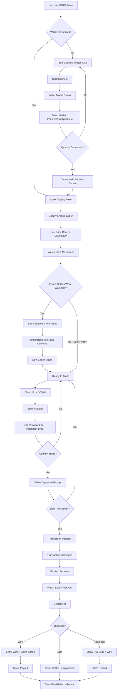
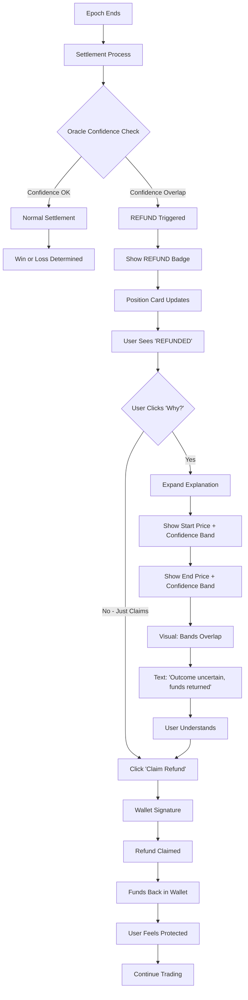
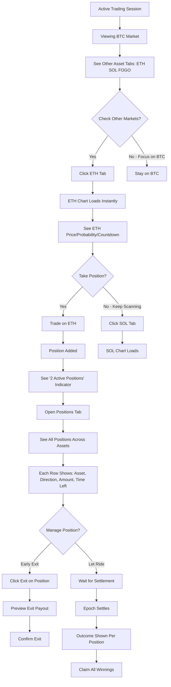
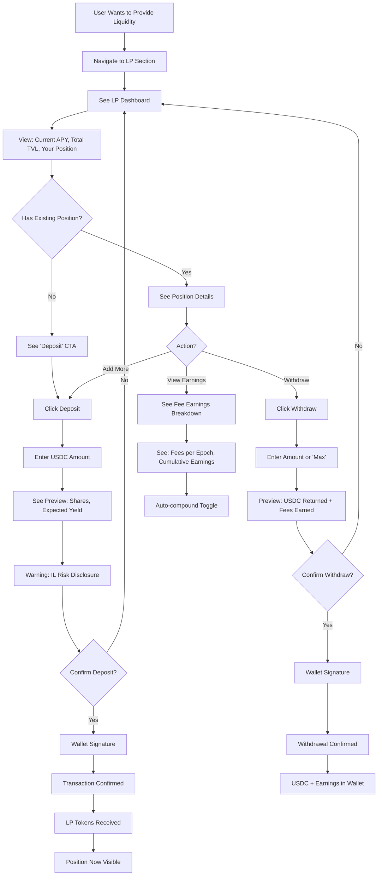
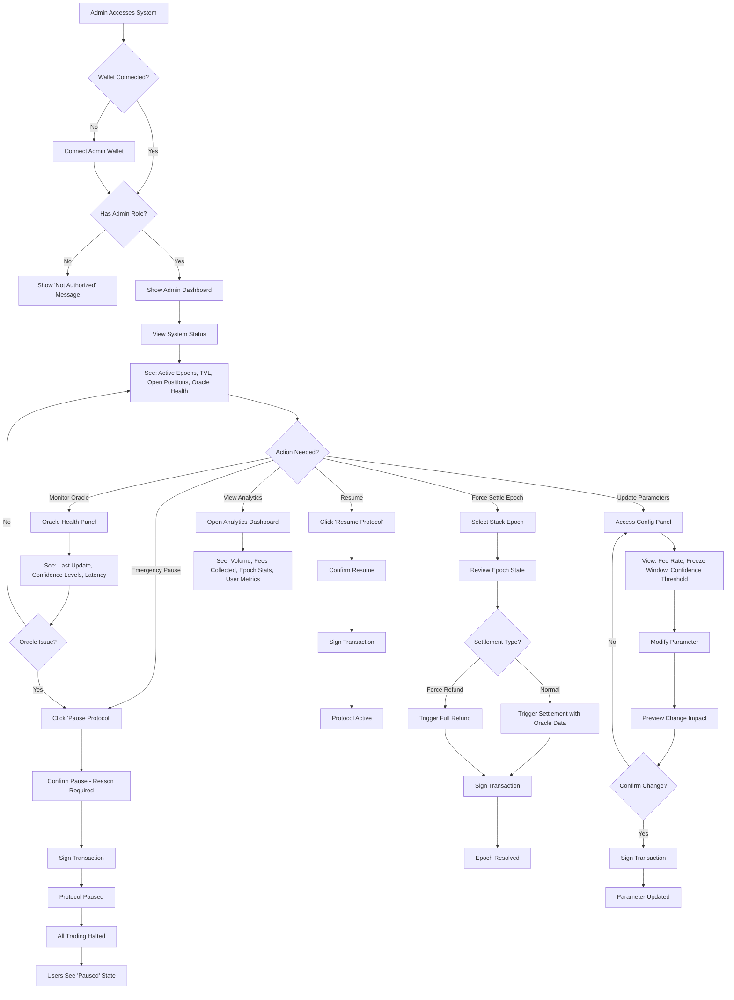

# UX Design Specification - FOGO Pulse

**Author:** theRoad
**Date:** 2026-03-11

---

## Executive Summary

### Project Vision

FOGO Pulse is a short-duration binary prediction market on FOGO chain that enables users to trade the directional movement of crypto assets over 5-minute windows. Users take UP or DOWN positions on price direction, with continuous trading and early exit enabled by a constant-product AMM (CPMM).

The core UX philosophy centers on **trust through transparency**. Settlement uses Pyth Lazer oracles with confidence-aware resolution - if oracle uncertainty overlaps the decision threshold, the epoch refunds rather than forcing a potentially unfair outcome. This "we'd rather refund than guess" approach is the product's signature trust signal.

**What Makes This Special:**
- **Trust-first settlement** - Confidence-aware refunds signal credibility in a space with reputation problems
- **Informed trading, not blind betting** - UI surfaces price, probability, pool depth, and confidence indicators for real trading decisions
- **First-mover on FOGO** - No comparable product exists on FOGO chain
- **Fast feedback loops** - 5-minute epochs create engaging, repeatable trading experiences

### Target Users

| User Type | Description | Key Needs |
|-----------|-------------|-----------|
| **Retail Crypto Traders** | Active traders seeking fast directional trades | Speed, clear outcomes, trustworthy settlement |
| **DeFi-Native Users** | Comfortable with AMM mechanics and wallet interactions | Familiar patterns, advanced info available |
| **FOGO Ecosystem Participants** | Early adopters exploring the FOGO ecosystem | Easy onboarding, ecosystem integration |
| **Liquidity Providers** | Yield seekers looking for fee-based passive returns | Clear APY, risk disclosure, easy deposit/withdraw |

**Tech Savviness:** Medium-high. Users understand crypto wallets, transaction signing, and basic DeFi concepts. They should not need tutorials on wallet connection but may need guidance on FOGO-specific context.

**Primary Device:** Desktop (trading requires focus and quick decisions). Mobile-responsive is secondary priority.

### Key Design Challenges

1. **Information Density vs. Clarity**
   - Users need simultaneous visibility of: current price, start price, probability (pYES/pNO), pool depth, countdown timer, confidence indicators, their position, and potential payout
   - Challenge: Display critical information without overwhelming the interface

2. **Trust Through Transparency**
   - The refund mechanism is a trust differentiator, but only if users understand WHY it happened
   - Challenge: Explain "confidence overlap" visually and simply without technical jargon

3. **Time Pressure UX**
   - 5-minute windows with 15-second freeze periods create urgency
   - Challenge: Clearly communicate trading states (Open → Frozen → Settling → Settled) without causing panic or confusion

4. **Multi-State Complexity**
   - Epochs have states: Open, Frozen, Settling, Settled, Refunded
   - Positions have states: open, won, lost, refunded, claimed
   - Users may have positions across 4 assets simultaneously
   - Challenge: Clear state visualization across multiple concurrent contexts

5. **Web3 Friction**
   - Wallet connection, transaction signing, FOGO-specific context
   - Challenge: Smooth onboarding without lengthy tutorials while clarifying "this is FOGO, not Solana"

### Design Opportunities

1. **Trust as Brand Differentiator**
   - Make settlement data fully visible (start price, end price, confidence bands)
   - "Verify yourself" transparency could build strong user loyalty
   - Position FOGO Pulse as "the prediction market that doesn't hide anything"

2. **First-Epoch Spectator Mode**
   - Design for watching before trading (Marcus's journey)
   - Make it compelling to observe an epoch play out without participating
   - Build confidence through observation before first trade

3. **Refund as Positive Experience**
   - Reframe "something went wrong" as "system protecting you"
   - Counter-intuitive UX that becomes a brand signature
   - Users should feel good about refunds, not frustrated

4. **Speed + Simplicity for Repeat Actions**
   - Fast trading loops mean optimizing for repeat users
   - "One-tap trade" patterns after initial setup
   - Habit-forming quick actions for returning traders

## Core User Experience

### Defining Experience

**Primary User Action:** Taking a directional position (UP or DOWN) on an asset within an active epoch.

The core loop is:
1. **Observe** - See current price, start price, probability, countdown
2. **Decide** - Choose UP or DOWN based on market read
3. **Execute** - Enter amount, preview outcome, confirm trade
4. **Wait** - Watch countdown, see price movement
5. **Resolve** - Settlement happens, outcome displayed, payout/refund processed
6. **Repeat** - Next epoch begins, cycle continues

**Critical Interaction:** The trade execution moment - from decision to confirmation. User sees price, probability, makes a choice (UP/DOWN), enters amount, sees preview (fees, slippage, potential payout), and confirms. This must feel instant and confident.

### Platform Strategy

| Aspect | Decision | Rationale |
|--------|----------|-----------|
| **Primary Platform** | Web application (desktop-first) | Trading requires focus, multiple data points, quick decisions |
| **Secondary Platform** | Mobile-responsive web | Check positions, simple trades on-the-go |
| **Native Mobile App** | Not for MVP | Web-first proves concept before native investment |
| **Input Method** | Mouse/keyboard primary | Precision clicking, keyboard shortcuts for power users |
| **Offline Support** | None | Real-time chain data required for all functionality |
| **Browser Support** | Modern browsers (Chrome, Firefox, Edge, Safari) | Wallet extension compatibility |
| **Wallet Integration** | Solana-compatible extensions (Phantom, Backpack, Nightly) | Connected to FOGO RPC, not Solana |

### Effortless Interactions

**What Should Feel Magical:**

| Interaction | Target Experience |
|-------------|-------------------|
| **Trade execution** | One clear action to go UP or DOWN, all context visible beforehand |
| **State awareness** | Instantly know: "Am I in a trade? What's happening? Can I act?" |
| **Outcome comprehension** | Settlement happens → immediately know won/lost/refunded and why |
| **Position overview** | At a glance, see all active positions across 4 assets |
| **Asset switching** | Quick scan of all markets, one click to switch focus |

**Friction Points to Eliminate:**

| Current Problem (Competitors) | FOGO Pulse Solution |
|-------------------------------|---------------------|
| Opaque settlement ("how did they determine I lost?") | Full transparency: start price, end price, confidence values |
| Confusing probability displays | Clear pYES/pNO with visual representation |
| Too many clicks to execute a trade | Single-screen trade flow, no modals or page changes |
| Unclear when trading is/isn't allowed | Prominent epoch state indicator with countdown |
| Hidden fees and slippage | Preview shows exact fees and worst-case slippage before confirm |

### Critical Success Moments

| Moment | Description | Success Criteria |
|--------|-------------|------------------|
| **First epoch observation** | User watches without trading, sees settlement happen | User thinks "I understand how this works" |
| **First trade execution** | User places their first position | Transaction confirms quickly, position appears immediately |
| **First winning trade** | User's position is on the winning side | Clear "YOU WON" display, payout amount visible, claim flow obvious |
| **First refund experience** | Epoch refunds due to confidence overlap | User sees explanation, thinks "that's fair" not "I got cheated" |
| **Quick repeat trade** | Subsequent trades after learning the system | Feels faster and more confident than first trade |
| **Multi-asset awareness** | User scans all 4 markets | Can quickly identify which market has interesting opportunity |
| **Early exit execution** | User sells position before epoch ends | Understands they're selling to AMM, sees updated payout |

**Make-or-Break Flows:**
1. Trade execution during Open state (must feel instant and confident)
2. Settlement outcome display (must be immediately clear and verifiable)
3. Refund explanation flow (must build trust, not erode it)

### Experience Principles

These principles guide all UX decisions for FOGO Pulse:

| Principle | Description | Applied To |
|-----------|-------------|------------|
| **State Clarity First** | Users always know: What state is the epoch in? Can I act? What's my position? | Epoch indicators, trade buttons, position displays |
| **One-Glance Decision Making** | All information needed to make a trade decision visible simultaneously | Market view layout, trade ticket design |
| **Transparent Outcomes** | Every settlement shows the math: start price, end price, confidence, outcome | Settlement display, history view, refund explanations |
| **Speed for Repeat Actions** | First trade can be deliberate; subsequent trades should feel instant | Quick trade shortcuts, remembered preferences |
| **Graceful Uncertainty** | When something unusual happens (refund, freeze, error), explain clearly and reassure | Error states, refund UX, freeze window messaging |

**Principle Hierarchy:** When principles conflict, prioritize in order: State Clarity → Transparent Outcomes → One-Glance → Speed → Graceful Uncertainty

## Desired Emotional Response

### Primary Emotional Goals

| Emotion | Description | Why It Matters |
|---------|-------------|----------------|
| **Confident** | Users feel informed and in control of their decisions | Financial decisions require clarity, not guesswork |
| **Trusting** | Users believe the system is fair and transparent | The "confidence-aware refund" mechanism only works if users trust it |
| **Engaged** | 5-minute loops feel exciting and compelling | Fast feedback creates habit-forming engagement |
| **Respected** | Users feel the system treats them fairly, even when losing | Fairness perception drives retention and word-of-mouth |

**Signature Emotional Moment:** "This is the first prediction market where I actually understand what happened and trust the outcome."

**Emotional Differentiator:** Trust through radical transparency. Most prediction markets feel like black boxes. FOGO Pulse should feel like glass.

### Emotional Journey Mapping

| Stage | Target Emotion | Design Implication |
|-------|----------------|-------------------|
| **First Discovery** | Curious, intrigued | Clean interface that invites exploration without overwhelming |
| **First Observation** | Understanding, "I get it" | Clear visualization of epoch lifecycle, settlement visible |
| **First Trade** | Confident, deliberate | All information visible, no hidden surprises, clear confirmation |
| **Waiting for Settlement** | Engaged, anticipatory | Live price feed, countdown creates healthy tension |
| **Winning** | Validated, accomplished | Clear celebration, easy claim, "the system worked" |
| **Losing** | Accepting, fair | Clear explanation, no ambiguity, "I made the call, it didn't work out" |
| **Refunded** | Protected, understood | "System looked out for me" not "something broke" |
| **Returning** | Familiar, efficient | Faster flow, remembered context, "I know this" feeling |

### Micro-Emotions

**Critical Emotional States to Design For:**

| Emotion Pair | Target State | Avoid State |
|--------------|--------------|-------------|
| **Confidence ↔ Confusion** | Confident (know exactly what's happening) | Confusion (what state am I in? what happened?) |
| **Trust ↔ Skepticism** | Trust (system is fair and transparent) | Skepticism (did I get cheated?) |
| **Excitement ↔ Anxiety** | Healthy excitement (engaging game) | Anxiety (stressful gambling feeling) |
| **Accomplishment ↔ Frustration** | Accomplishment even in loss (made informed decision) | Frustration (system was unfair) |

**The Refund Moment (Critical Design Challenge):**
- **Wrong emotion:** "The system failed me" / "I was robbed of a win"
- **Right emotion:** "The system protected me from an unfair outcome"

### Design Implications

| Desired Emotion | UX Design Approach |
|-----------------|-------------------|
| **Confidence** | Show all decision-relevant data simultaneously; preview exact outcomes before confirmation |
| **Trust** | Display start/end prices with confidence values; let users verify settlement math |
| **Engagement** | Live countdown with visual urgency; smooth price chart animation |
| **Fairness (in loss)** | Show exactly what prices were, no ambiguity; "You predicted UP, price went DOWN by X%" |
| **Protected (in refund)** | Visual confidence band overlap; "We couldn't be certain, so we refunded" messaging |
| **Efficiency (returning)** | Remember last asset, quick trade shortcuts, minimal re-orientation |

**Emotions to Actively Avoid:**

| Emotion | What Causes It | Prevention Strategy |
|---------|----------------|---------------------|
| **Panic** | Time pressure without clarity | Clear countdown, obvious freeze state, no sudden surprises |
| **Suspicion** | Opaque settlement | Full transparency, verifiable on-chain data |
| **Regret** | Hidden fees, unexpected slippage | Preview shows exact fees and worst-case before confirm |
| **Abandoned** | Errors without explanation | Clear error messages, suggested actions, support paths |
| **Addicted/Compulsive** | Gambling dark patterns | No "near miss" psychology, no push notifications, no streaks |

### Emotional Design Principles

1. **Informed Over Impulsive** - Design should encourage thoughtful decisions, not rapid gambling. Show information, not urgency tricks.

2. **Transparency Builds Trust** - Every outcome should be verifiable. If users can prove to themselves the settlement was fair, trust compounds.

3. **Losing Should Feel Fair** - A loss where the user understands exactly what happened is better than a win that feels lucky.

4. **Protection Over Frustration** - Refunds are a feature, not a bug. Design should make users grateful for the safety net, not annoyed by the interruption.

5. **Respect User Intelligence** - DeFi-native users are sophisticated. Don't patronize with excessive hand-holding, but don't hide complexity either.

## UX Pattern Analysis & Inspiration

### Inspiring Products Analysis

#### Polymarket (Prediction Markets)
- Binary YES/NO probability display with clear visual bar
- Market cards enabling quick scanning of multiple markets
- "Your Position" section visible when holding
- Weakness: Settlement explanations can be opaque

#### Uniswap (AMM Trading)
- Single-screen swap interface with everything visible
- Preview showing exact output, fees, price impact before confirmation
- Wallet-first design with clear connection flow
- Transaction status: pending → confirmed → complete
- Weakness: Error messages often too technical

#### TradingView (Real-Time Data)
- Information density done right through hierarchy
- Real-time price updates that feel alive
- Chart as central visual anchor
- Watchlist pattern for multi-asset awareness
- Weakness: Can overwhelm casual users

#### Primary Chart Reference (Binary Prediction Market)

**Source:** Short-duration prediction market chart interface

This reference becomes the primary inspiration for FOGO Pulse's chart component:

**Header Elements:**
- Asset icon + "Bitcoin Up or Down - 5 Minutes" title
- Date and time range of epoch (e.g., "March 11, 8-8:05AM ET")
- **Price to Beat:** Large, prominent start price ($69,173.98)
- **Current Price:** Live updating with delta indicator (▼ $64)
- **Countdown Timer:** "00 MINS 25 SECS" - prominent, right-aligned

**Chart Elements:**
- **Smooth line chart** with ~10 second data point intervals
- **Target line:** Dashed horizontal line at "Price to Beat" with "Target" label
- **Current price indicator:** Highlighted dot at chart edge
- **Y-axis scale:** ~50 point increments for appropriate granularity
- **Position markers:** User's entry points shown on left side with stake amounts (+$978, +$59, etc.)
- **Time axis:** Showing seconds-level timestamps

**Color Scheme:**
- Dark background
- Orange/amber price line
- Dashed target line
- Position amounts in accent color

**Key UX Patterns to Adopt:**
- "Price to Beat" terminology (clearer than "start price")
- Real-time delta showing distance from target (▲/▼ $XX)
- Target line with visual label
- Position markers on chart showing entry points
- Smooth 10-second interval rendering
- Countdown in MM:SS format, top right

### Transferable UX Patterns

**Navigation Patterns:**
- Wallet connection as primary entry point (Uniswap)
- Multi-asset watchlist bar for quick scanning (TradingView)
- Market cards for asset selection (Polymarket)

**Interaction Patterns:**
- Single-screen trade execution (Uniswap)
- Preview before confirm with full transparency (Uniswap)
- Binary probability visualization (Polymarket)
- Real-time price tick animation (TradingView)

**Visual Patterns:**
- Chart as hero element with "Price to Beat" target line (Primary Reference)
- Information hierarchy: primary data large, secondary smaller (TradingView)
- Transaction status indicators (Uniswap)
- Position summary always visible when holding (Polymarket)
- Delta indicator showing +/- from target (Primary Reference)

**Chart-Specific Patterns (from Primary Reference):**
- Smooth line with ~10 second intervals
- Dashed target line at epoch start price
- ~50 point Y-axis increments
- Position entry markers on chart
- Live countdown in header

### Anti-Patterns to Avoid

| Anti-Pattern | Risk | Prevention |
|--------------|------|------------|
| Hidden fees revealed late | Destroys trust | Fees visible in preview before confirm |
| Opaque settlement | "How did I lose?" frustration | Full price/confidence transparency |
| Modal hell (3+ clicks to trade) | Friction kills repeat usage | Single-screen trade flow |
| Jargon without explanation | Confuses users | Tooltips, plain language |
| Gambling dark patterns | Encourages impulsive behavior | No streaks, no "almost won" |
| Unclear state transitions | Anxiety about trade status | Explicit status at every step |
| Cluttered charts | Information overload | Clean line, minimal indicators, clear target |

### Design Inspiration Strategy

**Adopt Directly:**

| Pattern | Source | Application |
|---------|--------|-------------|
| "Price to Beat" + delta display | Primary Reference | Chart header with live difference |
| Target line with label | Primary Reference | Dashed line at epoch start price |
| Smooth 10-sec line chart | Primary Reference | Price movement visualization |
| Position markers on chart | Primary Reference | Show user entry points with amounts |
| ~50 point Y-axis scale | Primary Reference | Appropriate granularity |
| Binary probability bar | Polymarket | UP/DOWN visualization |
| Preview before confirm | Uniswap | Trade ticket transparency |
| Transaction status flow | Uniswap | Trade confirmation UX |

**Adapt for FOGO Pulse:**

| Pattern | Source | Adaptation |
|---------|--------|------------|
| Market cards | Polymarket | Add epoch countdown, Open/Frozen state |
| Watchlist | TradingView | Simplified 4-asset bar with probabilities |
| Position summary | Polymarket | Add epoch context, time remaining |
| Countdown timer | Primary Reference | Include freeze warning at 15 seconds |

**Explicitly Avoid:**

| Pattern | Why |
|---------|-----|
| Multi-step modals | Conflicts with speed principle |
| Opaque resolution | Conflicts with transparency principle |
| Overwhelming chart indicators | Keep it clean like reference |
| Gambling mechanics | Conflicts with informed trading goal |

### Theme Strategy

| Aspect | Decision | Rationale |
|--------|----------|-----------|
| **Default Theme** | Dark | Matches trading app conventions, easier on eyes for extended sessions, aligns with reference design |
| **Alternative Theme** | Light (user toggle) | Accessibility, user preference, outdoor/bright environment use |
| **Implementation** | Dark-first design, light as adaptation | Primary design effort on dark, ensure light theme works but secondary priority |

## Design System Foundation

### Design System Choice

**Selected:** shadcn/ui + Tailwind CSS

| Aspect | Decision |
|--------|----------|
| **Component Library** | shadcn/ui (copy-paste components, full ownership) |
| **Styling** | Tailwind CSS utility classes |
| **Primitives** | Radix UI (accessibility built-in) |
| **Icons** | Lucide React (shadcn default) |
| **Charts** | TBD - likely Recharts or lightweight-charts for trading view |
| **Forms** | React Hook Form + Zod (shadcn pattern) |

### Rationale for Selection

| Factor | Why shadcn/ui + Tailwind |
|--------|--------------------------|
| **Dark theme excellence** | Built-in dark mode with CSS variables, easy customization |
| **Trading UI precision** | Tailwind utilities enable pixel-perfect data-dense layouts |
| **Chart compatibility** | Works seamlessly with charting libraries |
| **DeFi conventions** | Widely adopted in DeFi ecosystem - familiar patterns |
| **Full customization** | Code lives in repo, can match reference design exactly |
| **Development speed** | Copy components, modify as needed, ship fast |
| **No lock-in** | Components are yours, not a dependency |
| **TypeScript first** | Full type safety out of the box |
| **Accessibility** | Radix primitives ensure WCAG compliance |

### Implementation Approach

**Development Workflow:**

1. **shadcn MCP Integration** - Use shadcn MCP server to:
   - Check component implementations before coding
   - View component examples and usage patterns
   - Understand available variants and props
   - Reference demo code for complex components

2. **Component Installation:**
   ```bash
   npx shadcn@latest init
   npx shadcn@latest add button card dialog tabs ...
   ```

3. **Customization Flow:**
   - Install base component via CLI
   - Check MCP for implementation details
   - Modify component code in `components/ui/`
   - Extend with custom variants as needed

**Key shadcn Components for FOGO Pulse:**

| Component | Use Case |
|-----------|----------|
| `Button` | Trade buttons (UP/DOWN), actions |
| `Card` | Market cards, position summaries |
| `Tabs` | Asset switching, section navigation |
| `Dialog` | Confirmations, refund explanations |
| `Tooltip` | Info hints, term explanations |
| `Badge` | Status indicators (Open, Frozen, Won, Lost) |
| `Progress` | Probability bars, countdown visualization |
| `Skeleton` | Loading states |
| `Toast` | Transaction notifications |
| `Sheet` | Mobile navigation, LP panel |

### Customization Strategy

**Design Tokens (CSS Variables):**

```css
/* Dark theme (default) */
:root {
  --background: /* dark bg */;
  --foreground: /* light text */;
  --primary: /* FOGO brand accent */;
  --accent: /* orange/amber for price line */;
  --success: /* green for UP/wins */;
  --destructive: /* red for DOWN/losses */;
  --warning: /* yellow for freeze/caution */;
  --muted: /* secondary text */;
}

/* Light theme (toggle) */
.light {
  /* inverted values */
}
```

**Custom Components Needed:**

| Component | Description |
|-----------|-------------|
| `PriceChart` | Smooth line chart with target line (custom build) |
| `EpochCountdown` | MM:SS countdown with freeze warning |
| `ProbabilityBar` | UP/DOWN probability visualization |
| `TradeTicket` | Combined trade form with preview |
| `PositionCard` | User position with status and actions |
| `AssetSwitcher` | 4-asset quick navigation |
| `WalletButton` | Wallet connection with FOGO context |
| `SettlementExplainer` | Refund/outcome explanation modal |

**Tailwind Extensions:**

```js
// tailwind.config.js
module.exports = {
  theme: {
    extend: {
      colors: {
        'fogo': { /* brand colors */ },
        'up': { /* green shades */ },
        'down': { /* red shades */ },
      },
      animation: {
        'price-tick': /* smooth price update */,
        'countdown-pulse': /* urgency indicator */,
      }
    }
  }
}
```

### Development Resources

| Resource | Purpose |
|----------|---------|
| **shadcn MCP** | Check component implementations, view examples before coding |
| **shadcn/ui docs** | Official documentation and patterns |
| **Tailwind docs** | Utility class reference |
| **Radix UI docs** | Accessibility patterns, primitive behavior |

## Defining Experience

### The Core Interaction

> **"Predict UP or DOWN in seconds, see exactly what happened when it settles"**

This captures both the **action** (quick directional trade) and the **differentiator** (transparent settlement). If we nail this interaction, everything else follows.

**What users will tell friends:** "You pick if the price goes up or down in 5 minutes, and you can actually see exactly why you won or lost."

### User Mental Model

**How users think about FOGO Pulse:**

| Mental Model | Design Implication |
|--------------|-------------------|
| "It's like betting on price direction" | UP/DOWN is intuitive - leverage familiarity |
| "5 minutes is short - quick feedback" | Design for fast loops, minimal friction |
| "AMM means I'm trading against a pool" | Show pool depth, probability reflects pool state |
| "Probability shows crowd sentiment" | pYES/pNO indicates market consensus |
| "I can exit early if I change my mind" | Early exit option visible but not primary |

**What users expect:**
- See current price and where it started ("Price to Beat")
- Understand probability at a glance
- Execute trade quickly (minimal clicks)
- Watch countdown and price movement in real-time
- Know immediately what happened when it settles
- Understand WHY they won/lost/got refunded

**Potential confusion points:**

| Confusion | Solution |
|-----------|----------|
| "What's the 'Price to Beat'?" | Clear labeling, tooltip on first view |
| "Why did I get refunded?" | Expandable explanation with confidence visualization |
| "What's the freeze window?" | State badge changes, countdown color shift |
| "How much will I win?" | Payout preview before confirm |

### Success Criteria

**The trade flow succeeds when users feel:**

| Criteria | How We Achieve It |
|----------|-------------------|
| "I understand what I'm betting on" | Price to Beat visible, delta showing distance |
| "I know exactly what I'll pay and might win" | Fee + potential payout in preview before confirm |
| "That was fast" | < 3 clicks from decision to confirmation |
| "I can see what's happening" | Live price chart, countdown, clear state badges |
| "I know exactly what happened" | Settlement shows start price, end price, confidence, outcome |
| "That was fair" | Even losses feel transparent, refunds feel protective |

**Success Indicators:**
1. User completes first trade without asking "what does this mean?"
2. User watches settlement and immediately understands outcome
3. User returns for second trade (trust established)
4. User explains refund mechanism positively to others

### Novel vs. Established Patterns

| Aspect | Pattern Type | Implementation Notes |
|--------|--------------|---------------------|
| UP/DOWN selection | Established | Binary choice - universal pattern |
| Trade preview | Established | Uniswap pattern - show before confirm |
| Countdown timer | Established | Gaming/betting UX - familiar urgency |
| Price chart | Established | TradingView pattern - line chart |
| "Price to Beat" terminology | **Novel** | Our specific framing - needs clear labeling |
| Target line on chart | Semi-novel | Visual anchor from reference design |
| Confidence-aware refund | **Novel** | Trust differentiator - needs explanation UX |
| Position markers on chart | Novel | Shows entry points visually - unique feature |
| Delta display (▲/▼ $XX) | Semi-novel | Real-time distance from target |

**For novel elements:**
- Clear labeling (use "Price to Beat" consistently)
- Visual cues (target line is prominent)
- Explanation on hover/click for complex concepts
- First-time hints that don't repeat for returning users

### Experience Mechanics

**The Complete Trade Flow:**

#### 1. OBSERVE
User lands on market view and sees:
- Chart with smooth price line + dashed target line
- **Price to Beat:** $69,173.98 (large, prominent)
- **Current Price:** $69,105.32 (▼ $68) - live updating
- **Countdown:** 04:25 remaining
- **Probability bar:** UP 48% | DOWN 52%
- **State badge:** "OPEN - Trading Active"

#### 2. DECIDE
User forms opinion based on:
- Current delta from target (down $68 - might recover?)
- Probability (slight DOWN bias - contrarian opportunity?)
- Time remaining (enough time for movement?)

User clicks **[UP]** or **[DOWN]** button to indicate direction.

#### 3. PREVIEW
Trade ticket shows before confirmation:
```
You're predicting: UP
Amount: 50 USDC
Fee: 0.90 USDC (1.8%)
If UP wins: ~95 USDC (+90%)
If DOWN wins: 0 USDC
Price impact: 0.3%

[Confirm Trade]
```

**Critical:** All costs and outcomes visible BEFORE confirmation.

#### 4. EXECUTE
- User clicks [Confirm Trade]
- Wallet prompts for signature
- Transaction status: Pending → Confirmed
- Position appears immediately: "UP | 50 USDC | Entry: $69,105"
- Position marker appears on chart at entry price

#### 5. WAIT
User watches epoch play out:
- Price line moving in real-time (~10 second updates)
- Delta updating live (▲ $12 - price recovering)
- Countdown ticking down
- Position showing current standing

**At 00:15 remaining (Freeze Window):**
- State badge changes: "FROZEN - Settlement Soon"
- Trade buttons disabled (grayed out)
- Countdown color shifts to amber/warning
- Message: "Trading paused for settlement"

#### 6. SETTLE
Epoch ends, outcome determined:

**IF UP WINS:**
```
┌────────────────────────────────┐
│  ✓ YOU WON                     │
│                                │
│  Settlement: $69,180           │
│  ▲ $6 above Price to Beat      │
│                                │
│  Your payout: 95 USDC          │
│  [Claim Payout]                │
└────────────────────────────────┘
```

**IF DOWN WINS:**
```
┌────────────────────────────────┐
│  Position Lost                 │
│                                │
│  Settlement: $69,150           │
│  ▼ $24 below Price to Beat     │
│                                │
│  Final price was below target  │
└────────────────────────────────┘
```

**IF REFUNDED:**
```
┌────────────────────────────────┐
│  REFUNDED - Oracle Uncertain   │
│                                │
│  [Why?] ← expandable           │
│                                │
│  Your 50 USDC returned         │
│  [Claim Refund]                │
└────────────────────────────────┘

Expanded "Why?" shows:
- Start price confidence band
- End price confidence band
- Visual showing overlap
- "We couldn't be certain of the outcome,
   so we refunded to protect you."
```

#### 7. REPEAT
- New epoch starts automatically
- New "Price to Beat" displayed (from settlement oracle snapshot)
- User can trade again immediately
- History shows previous epoch result
- Fast path for repeat trades (remembered preferences)

### Flow Timing Summary

| Phase | Duration | User Action |
|-------|----------|-------------|
| Observe | Variable | Assess market, watch chart |
| Decide + Preview | ~5-10 seconds | Click direction, review preview |
| Execute | ~2-5 seconds | Confirm, sign wallet transaction |
| Wait | Remaining epoch time | Watch price, countdown |
| Freeze | ~15 seconds | No action - settlement pending |
| Settle | Instant | View outcome, claim if won |
| Repeat | Immediate | New epoch available |

## Visual Design Foundation

### Color System

**Theme Strategy:** Dark theme default, light theme available via toggle.

#### Dark Theme (Primary)

**Base Colors:**

| Token | Hex | RGB | Usage |
|-------|-----|-----|-------|
| `--background` | #0a0a0b | rgb(10, 10, 11) | Main canvas background |
| `--background-secondary` | #141415 | rgb(20, 20, 21) | Cards, elevated surfaces |
| `--background-tertiary` | #1f1f21 | rgb(31, 31, 33) | Hover states, subtle highlights |
| `--foreground` | #fafafa | rgb(250, 250, 250) | Primary text |
| `--foreground-muted` | #a1a1aa | rgb(161, 161, 170) | Secondary text, labels |
| `--border` | #27272a | rgb(39, 39, 42) | Subtle borders, dividers |
| `--border-focus` | #3f3f46 | rgb(63, 63, 70) | Focus rings, active borders |

**Semantic Colors:**

| Token | Hex | Usage |
|-------|-----|-------|
| `--primary` | #f7931a | Brand accent, price line, primary CTAs |
| `--primary-hover` | #f9a63a | Primary button hover |
| `--primary-muted` | #f7931a20 | Primary backgrounds (20% opacity) |
| `--up` | #22c55e | UP buttons, wins, positive delta (▲) |
| `--up-hover` | #16a34a | UP button hover |
| `--up-muted` | #22c55e20 | UP backgrounds |
| `--down` | #ef4444 | DOWN buttons, losses, negative delta (▼) |
| `--down-hover` | #dc2626 | DOWN button hover |
| `--down-muted` | #ef444420 | DOWN backgrounds |
| `--warning` | #f59e0b | Freeze state, cautions, warnings |
| `--warning-muted` | #f59e0b20 | Warning backgrounds |
| `--info` | #3b82f6 | Informational, links, neutral actions |

**Chart-Specific Colors:**

| Token | Hex | Usage |
|-------|-----|-------|
| `--chart-line` | #f7931a | Price line (orange/amber) |
| `--chart-target` | #a1a1aa | Dashed target line (muted) |
| `--chart-grid` | #27272a | Chart grid lines (subtle) |
| `--chart-position-marker` | #f7931a | User position entry markers |

#### Light Theme (Secondary)

| Token | Light Value | Notes |
|-------|-------------|-------|
| `--background` | #ffffff | White canvas |
| `--background-secondary` | #f4f4f5 | Light gray cards |
| `--foreground` | #09090b | Near-black text |
| `--foreground-muted` | #71717a | Gray secondary text |
| `--border` | #e4e4e7 | Light borders |

*Semantic colors (primary, up, down, warning) remain the same for brand consistency.*

#### Color Accessibility

| Requirement | Target | Implementation |
|-------------|--------|----------------|
| Text contrast (normal) | WCAG AA (4.5:1) | All text on backgrounds |
| Text contrast (large) | WCAG AA (3:1) | Headings, buttons |
| UI component contrast | WCAG 2.1 (3:1) | Borders, icons, controls |
| Color-blind safe | Distinguishable | UP/DOWN also use icons (▲/▼) |

### Typography System

**Font Stack:**

```css
--font-sans: "Inter", -apple-system, BlinkMacSystemFont, "Segoe UI", Roboto, sans-serif;
--font-mono: "JetBrains Mono", "Fira Code", ui-monospace, monospace;
```

**Why Inter:**
- Excellent readability at all sizes
- Tabular figures for number alignment (critical for trading data)
- Wide language support
- Free and open source
- Well-supported in Tailwind/shadcn

**Type Scale:**

| Token | Size | Weight | Line Height | Usage |
|-------|------|--------|-------------|-------|
| `text-xs` | 12px | 400 | 1.5 | Labels, captions |
| `text-sm` | 14px | 400 | 1.5 | Secondary info, table cells |
| `text-base` | 16px | 400 | 1.5 | Body text, descriptions |
| `text-lg` | 18px | 500 | 1.5 | Subheadings, emphasis |
| `text-xl` | 20px | 600 | 1.4 | Section headers |
| `text-2xl` | 24px | 600 | 1.3 | Page titles |
| `text-3xl` | 30px | 700 | 1.2 | Hero numbers (prices) |
| `text-4xl` | 36px | 700 | 1.1 | Large display numbers |

**Special Typography:**

| Use Case | Style | Notes |
|----------|-------|-------|
| **Price displays** | `text-3xl font-bold font-mono` | Monospace for alignment, tabular figures |
| **Delta values** | `text-lg font-semibold` + color | Green for ▲, red for ▼ |
| **Countdown** | `text-2xl font-bold font-mono` | Monospace for consistent width |
| **Labels** | `text-xs uppercase tracking-wide text-muted` | All caps, letter-spaced |
| **Button text** | `text-sm font-medium` | Clear, readable actions |

### Spacing & Layout Foundation

**Base Unit:** 4px (Tailwind default)

**Spacing Scale:**

| Token | Value | Usage |
|-------|-------|-------|
| `space-0.5` | 2px | Micro gaps |
| `space-1` | 4px | Tight spacing, icon gaps |
| `space-2` | 8px | Element gaps, small padding |
| `space-3` | 12px | Standard gaps |
| `space-4` | 16px | Card padding, section gaps |
| `space-6` | 24px | Large section spacing |
| `space-8` | 32px | Major section breaks |
| `space-12` | 48px | Page-level spacing |

**Layout Density:**

| Aspect | Decision | Rationale |
|--------|----------|-----------|
| **Overall density** | Medium-dense | Trading apps need info density |
| **Card padding** | 16-20px | Comfortable but compact |
| **Element gaps** | 8-12px | Tight but readable |
| **Section gaps** | 24-32px | Clear separation |

**Grid System:**

| Breakpoint | Columns | Usage |
|------------|---------|-------|
| Mobile (<640px) | 1 | Single column stack |
| Tablet (640-1024px) | 2 | Chart + sidebar |
| Desktop (1024-1280px) | 12 | Full layout flexibility |
| Wide (>1280px) | 12 | Max-width container |

**Primary Layout Structure (Desktop):**

```
┌─────────────────────────────────────────────────────────────────┐
│ HEADER: Logo | Asset Tabs (BTC ETH SOL FOGO) | Wallet | Theme  │
├─────────────────────────────────────────────────────────────────┤
│                                                                 │
│  ┌─────────────────────────────────┐  ┌─────────────────────┐  │
│  │                                 │  │                     │  │
│  │         CHART AREA              │  │    TRADE TICKET     │  │
│  │    (Price line + target)        │  │                     │  │
│  │         ~65% width              │  │     ~35% width      │  │
│  │                                 │  │                     │  │
│  └─────────────────────────────────┘  └─────────────────────┘  │
│                                                                 │
│  ┌─────────────────────────────────────────────────────────┐   │
│  │              POSITIONS / HISTORY TABS                    │   │
│  └─────────────────────────────────────────────────────────┘   │
│                                                                 │
└─────────────────────────────────────────────────────────────────┘
```

**Component Spacing Relationships:**

| Relationship | Spacing | Example |
|--------------|---------|---------|
| Within card sections | 8-12px | Between form fields |
| Between card sections | 16px | Between trade preview and button |
| Card to card | 16-24px | Between chart card and ticket card |
| Section to section | 24-32px | Between trading area and history |

### Border Radius System

| Token | Value | Usage |
|-------|-------|-------|
| `rounded-sm` | 4px | Small elements, tags, badges |
| `rounded` | 6px | Buttons, inputs |
| `rounded-md` | 8px | Cards, panels |
| `rounded-lg` | 12px | Large cards, modals |
| `rounded-full` | 9999px | Pills, circular buttons |

### Shadow System (Dark Theme)

| Token | Value | Usage |
|-------|-------|-------|
| `shadow-sm` | Subtle edge definition | Cards on dark bg |
| `shadow` | Medium elevation | Dropdowns, tooltips |
| `shadow-lg` | Strong elevation | Modals, dialogs |

*Note: Shadows are subtle in dark themes - rely more on border/background contrast.*

### Accessibility Considerations

**Color Contrast:**
- All text meets WCAG AA (4.5:1 for normal, 3:1 for large)
- UP/DOWN distinguished by both color AND icon (▲/▼)
- Warning states use both color and text/icon indicators

**Motion & Animation:**
- Respect `prefers-reduced-motion` preference
- Price updates use subtle transitions (150-200ms)
- Countdown animations are smooth but not distracting
- No auto-playing animations that can't be paused

**Focus States:**
- Clear focus rings on all interactive elements
- Keyboard navigation support for all actions
- Focus trap in modals and dialogs

**Screen Reader Support:**
- Semantic HTML structure
- ARIA labels on icon-only buttons
- Live regions for price updates and state changes
- Announce settlement outcomes

## Design Direction Decision

### Design Directions Explored

Four design directions were generated and evaluated:

| Direction | Layout | Characteristics |
|-----------|--------|-----------------|
| **1: Reference Layout** | Chart left (65%), Trade ticket right (35%) | Matches reference screenshot, focused single-asset trading |
| **2: Compact View** | Full-width chart, horizontal trade flow below | Denser, smaller screen friendly |
| **3: Dashboard** | 2x2 grid showing all 4 assets | Multi-asset monitoring, portfolio view |
| **4: Mobile-First** | Single column, centered content | Touch-optimized, mobile experience |

**Interactive mockups available:** `_bmad-output/planning-artifacts/ux-design-directions.html`

### Chosen Direction

**Selected: Direction 1 - Reference Layout**

This direction directly follows the proven pattern from the reference screenshot, featuring:

- **Chart Area (65% width):** Dominant left side with smooth price line, target line, position markers
- **Trade Ticket (35% width):** Always-visible right panel with UP/DOWN buttons, amount input, preview
- **Header:** Logo, asset tabs (BTC/ETH/SOL/FOGO), wallet connection
- **Positions Section:** Below main trading area, tabbed with history

### Design Rationale

| Factor | Why Direction 1 |
|--------|-----------------|
| **Proven Pattern** | Directly matches successful reference design |
| **Focus** | Single-asset trading is primary use case |
| **Information Hierarchy** | Chart is hero, trade ticket is action area |
| **User Mental Model** | Matches TradingView-style layouts users know |
| **Trade Execution** | All trade context visible alongside chart |
| **Scalability** | Asset tabs enable quick switching without layout change |

**Secondary Considerations:**
- Direction 3 (Dashboard) may be valuable as a secondary view for multi-asset monitoring
- Direction 4 (Mobile) informs responsive breakpoint design

### Primary Layout Specification

```
Desktop (>1024px):
┌─────────────────────────────────────────────────────────────────┐
│ HEADER                                                          │
│ [Logo] [BTC] [ETH] [SOL] [FOGO]              [Wallet] [Theme]  │
├─────────────────────────────────────────────────────────────────┤
│                                                                 │
│  ┌──────────────────────────────────┐  ┌────────────────────┐  │
│  │                                  │  │                    │  │
│  │         CHART AREA               │  │   TRADE TICKET     │  │
│  │                                  │  │                    │  │
│  │  • Price to Beat (large)         │  │  • UP/DOWN buttons │  │
│  │  • Current Price + Delta         │  │  • Probability bar │  │
│  │  • Countdown timer               │  │  • Amount input    │  │
│  │  • Smooth line chart             │  │  • Quick amounts   │  │
│  │  • Target line (dashed)          │  │  • Fee preview     │  │
│  │  • Position markers              │  │  • Payout preview  │  │
│  │  • State badge (OPEN/FROZEN)     │  │  • Confirm button  │  │
│  │                                  │  │                    │  │
│  │         ~65% width               │  │     ~35% width     │  │
│  │                                  │  │                    │  │
│  └──────────────────────────────────┘  │  ┌──────────────┐  │  │
│                                        │  │ Your Position│  │  │
│                                        │  └──────────────┘  │  │
│                                        └────────────────────┘  │
│  ┌─────────────────────────────────────────────────────────┐   │
│  │ [Open Positions] [History]                               │   │
│  │                                                          │   │
│  │  Position list / History table                           │   │
│  └─────────────────────────────────────────────────────────┘   │
│                                                                 │
└─────────────────────────────────────────────────────────────────┘

Tablet (640-1024px):
- Chart and ticket stack vertically
- Chart full width, ticket below
- Reduced padding

Mobile (<640px):
- Single column (Direction 4 style)
- Bottom navigation
- Simplified chart
- Large touch targets
```

### Component Breakdown

**Header Components:**
- `Logo` - FOGO Pulse branding
- `AssetTabs` - BTC/ETH/SOL/FOGO switcher (tab style)
- `WalletButton` - Connect/disconnect with address display
- `ThemeToggle` - Dark/light switch

**Chart Area Components:**
- `ChartHeader` - Asset info, Price to Beat, Current Price, Delta, Countdown
- `PriceChart` - Smooth line chart with target line and position markers
- `StateBadge` - OPEN/FROZEN/SETTLING/SETTLED status

**Trade Ticket Components:**
- `DirectionButtons` - UP and DOWN with hover states
- `ProbabilityBar` - Visual UP/DOWN probability split
- `AmountInput` - USDC input with validation
- `QuickAmounts` - Preset amount buttons (10/25/50/100/MAX)
- `TradePreview` - Fee, potential payout calculations
- `ConfirmButton` - Primary action button
- `PositionCard` - Current position summary (if holding)

**Positions Section Components:**
- `PositionsTabs` - Open Positions / History toggle
- `PositionRow` - Individual position with asset, direction, amount, status, actions
- `HistoryRow` - Past epoch with outcome, payout, settlement details

## User Journey Flows

### Journey 1: First-Time Trader (Marcus)

**Goal:** Connect wallet → Observe epoch → Place first trade → Experience settlement → Build trust



**Key Design Decisions:**
- Spectator mode encouraged before first trade (watch an epoch settle)
- Preview shows ALL costs before confirmation
- Settlement explains outcome clearly with prices
- Refund path builds trust through transparency

**Critical Moments:**
| Moment | Success Criteria |
|--------|------------------|
| Wallet connection | < 3 clicks, familiar wallet modal |
| First observation | User understands epoch lifecycle without help |
| Trade preview | No surprises - fees and payouts crystal clear |
| Settlement | Immediate understanding of outcome |

---

### Journey 2: Refund Experience

**Goal:** User experiences a refund and feels protected, not cheated



**Key Design Decisions:**
- "Why?" is expandable, not forced on user
- Visual confidence band overlap IS the explanation
- Framing: "protected" not "system failed"
- Smooth claim flow identical to win claim

**Refund Explanation Content:**
```
REFUNDED - Oracle Uncertain

The price at settlement was too close to call with confidence.

Start Price: $69,173.98 ± $2.50
End Price:   $69,174.12 ± $3.20

[Visual showing overlapping confidence bands]

Because the confidence ranges overlap, we couldn't
determine a fair winner. Your funds have been returned.

This protects you from unfair outcomes.

[Claim Refund: 50 USDC]
```

---

### Journey 3: Multi-Asset Trader (Priya)

**Goal:** Monitor and trade across multiple assets efficiently



**Key Design Decisions:**
- Asset tabs enable instant switching (no page reload)
- Chart data swaps, layout stays consistent
- Positions section shows ALL assets simultaneously
- "Claim All" button for efficiency when multiple wins

**Multi-Asset UI Elements:**
| Element | Behavior |
|---------|----------|
| Asset tabs | Instant switch, highlight active |
| Position counter | Badge showing "2 Active" in header |
| Positions list | All assets, sortable by time remaining |
| Claim All | Single transaction for multiple payouts |

---

### Journey 4: Liquidity Provider (Derek)

**Goal:** Deposit liquidity, earn fees, withdraw with yield



**Key Design Decisions:**
- LP is separate section (tab/route), not cluttering trader view
- Clear APY display with "estimated" disclaimer
- Risk disclosure required before first deposit
- Auto-compound option for passive LPs
- Earnings breakdown for transparency

**LP Dashboard Components:**
| Component | Content |
|-----------|---------|
| APY Display | Current estimated APY, historical range |
| TVL | Total value locked in pool |
| Your Position | USDC deposited, LP tokens held, current value |
| Earnings | Fees earned (claimed + unclaimed) |
| Actions | Deposit, Withdraw, Claim Fees |

---

### Journey 5: Admin/Operator

**Goal:** Monitor system health, manage protocol, handle emergencies



**Admin Dashboard Components:**

| Component | Purpose |
|-----------|---------|
| System Status Card | Protocol state (Active/Paused), TVL, active epochs |
| Oracle Health Monitor | Pyth Lazer status, last update, confidence levels |
| Epoch Manager | List of epochs, ability to force settle/refund |
| Parameter Config | Fee rates, freeze window, confidence thresholds |
| Emergency Controls | Pause/Resume protocol with confirmation |
| Analytics Dashboard | Volume, fees, user metrics, epoch statistics |
| Audit Log | History of admin actions with timestamps |

**Admin-Specific States:**

| State | User View | Admin Action |
|-------|-----------|--------------|
| Protocol Paused | "Trading Paused" banner | Can resume when ready |
| Stuck Epoch | Epoch past expected settlement | Force settle or refund |
| Oracle Stale | Users see warning indicator | Monitor, may need to pause |
| High Confidence Variance | Normal trading continues | Watch for refund spikes |

**Security Considerations:**
- Role-based access control (on-chain authority check)
- Confirmation dialogs with reason required for destructive actions
- Timelock on sensitive parameter changes (optional for MVP)
- All admin actions logged on-chain for audit trail

**Admin UI Placement:** Separate `/admin` route, only accessible to authorized wallets.

---

### Journey Patterns

**Navigation Patterns:**

| Pattern | Usage | Implementation |
|---------|-------|----------------|
| Tab switching | Asset selection, Positions/History | Tabs component, no page reload |
| Section navigation | Trade → LP → Settings (→ Admin) | Top-level tabs or sidebar |
| Inline expansion | "Why?" explanations, advanced settings | Collapsible sections |
| Modal dialogs | Confirmations, wallet connection | Dialog component with backdrop |

**Decision Patterns:**

| Pattern | Usage | Implementation |
|---------|-------|----------------|
| Binary choice | UP/DOWN, Confirm/Cancel | Two prominent buttons |
| Preview before commit | Trade preview, deposit preview | Summary card before confirm button |
| Progressive disclosure | Hide complexity until requested | Expandable sections, tooltips |
| Destructive confirmation | Pause protocol, large withdrawals | Confirmation dialog with explicit action |

**Feedback Patterns:**

| Pattern | Usage | Implementation |
|---------|-------|----------------|
| Transaction status | Pending → Confirmed → Complete | Toast notifications + inline status |
| State badges | OPEN, FROZEN, WON, LOST, REFUNDED | Badge component with semantic colors |
| Live updates | Price ticks, countdown, delta | WebSocket/subscription, smooth transitions |
| Toast notifications | Trade confirmed, payout claimed | Toast component, auto-dismiss |
| Error messages | Transaction failed, insufficient funds | Inline error with recovery suggestion |

### Flow Optimization Principles

1. **Minimize Steps to Value**
   - First trade: Land → Connect → Observe → Trade = 4 steps max
   - Repeat trade: View → Click direction → Confirm = 3 steps
   - Claim payout: See outcome → Click claim → Sign = 2 steps

2. **Reduce Cognitive Load**
   - One decision per screen/section
   - Preview shows ALL information before commit
   - Consistent patterns across all journeys

3. **Clear Progress Indicators**
   - Transaction status always visible
   - Countdown shows time remaining
   - Position cards show current state

4. **Moments of Delight**
   - Win animation (subtle, not obnoxious)
   - Smooth price line animation
   - Satisfying claim confirmation

5. **Graceful Error Recovery**
   - Transaction failed → Clear message + retry option
   - Wallet disconnected → Reconnect prompt
   - Network issue → Status indicator + auto-retry

## Component Strategy

### Design System Components (shadcn/ui)

**Available components from shadcn/ui that we'll use:**

| Component | FOGO Pulse Usage |
|-----------|------------------|
| `Button` | Trade buttons, CTAs, actions |
| `Card` | Market cards, position cards, panels |
| `Tabs` | Asset tabs, Positions/History toggle |
| `Dialog` | Wallet modal, confirmations, refund explanation |
| `Tooltip` | Info hints, term explanations |
| `Badge` | Base for status indicators |
| `Progress` | Base for probability bar |
| `Input` | Amount input |
| `Skeleton` | Loading states |
| `Toast` | Transaction notifications |
| `Sheet` | Mobile navigation, LP panel |
| `Dropdown Menu` | Settings, wallet options |
| `Avatar` | Asset icons, wallet address |
| `Separator` | Visual dividers |
| `Switch` | Theme toggle, auto-compound |
| `Label` | Form labels |
| `Collapsible` | "Why?" expansion |

### Custom Components

#### PriceChart

**Purpose:** Visualize price movement during epoch with target line and position markers

**Props:**
| Prop | Type | Description |
|------|------|-------------|
| `priceData` | `{time: number, price: number}[]` | Price points (~10 sec intervals) |
| `targetPrice` | `number` | Price to beat (epoch start price) |
| `currentPrice` | `number` | Live current price |
| `positions` | `{price: number, amount: number}[]` | User's position entry points |
| `height` | `number` | Chart height in pixels |
| `state` | `'open' \| 'frozen' \| 'settled'` | Epoch state for styling |

**Visual Elements:**
- Smooth line chart with ~10 second data points
- Dashed horizontal target line at epoch start price
- Position markers showing user entry points with amounts
- Y-axis with ~50 point increments
- Current price dot with pulse animation
- Grid lines (subtle)

**States:**
- Open: Animated line drawing, live updates
- Frozen: Line stops animating, muted colors
- Settled: Final state, no animation

**Accessibility:** "Price chart showing current price $69,105, target price $69,174"

---

#### EpochCountdown

**Purpose:** Display time remaining in epoch with state-aware styling

**Props:**
| Prop | Type | Description |
|------|------|-------------|
| `endTime` | `number` | Epoch end timestamp |
| `freezeWindow` | `number` | Seconds before freeze (default 15) |
| `state` | `EpochState` | Current epoch state |

**States:**
| State | Time | Styling |
|-------|------|---------|
| Open | > 15 sec | Accent color, normal |
| Warning | ≤ 15 sec | Warning color, pulse animation |
| Frozen | 0 sec | Warning solid, "FROZEN" label |
| Settling | - | Loading indicator |
| Settled | - | "SETTLED" badge |

**Format:** `MM:SS` with monospace font for consistent width

**Accessibility:** Live region announcing "4 minutes 25 seconds remaining"

---

#### ProbabilityBar

**Purpose:** Visualize UP/DOWN probability split from AMM pool state

**Props:**
| Prop | Type | Description |
|------|------|-------------|
| `pUp` | `number` | Probability of UP (0-1) |
| `pDown` | `number` | Probability of DOWN (0-1) |
| `showLabels` | `boolean` | Show percentage labels |
| `size` | `'sm' \| 'md' \| 'lg'` | Bar height variant |

**Visual:** Split bar with green (UP) left, red (DOWN) right, proportional to probabilities

**Accessibility:** "UP probability 48 percent, DOWN probability 52 percent"

---

#### DirectionButtons

**Purpose:** UP/DOWN trade direction selection with semantic colors

**Props:**
| Prop | Type | Description |
|------|------|-------------|
| `selected` | `'up' \| 'down' \| null` | Current selection |
| `onSelect` | `(direction) => void` | Selection handler |
| `disabled` | `boolean` | Disable during frozen state |
| `size` | `'sm' \| 'md' \| 'lg'` | Button size |

**States:**
- Default: Both buttons muted/outlined
- Up Selected: UP solid green, DOWN muted
- Down Selected: DOWN solid red, UP muted
- Disabled: Both grayed out
- Hover: Subtle background change

**Accessibility:** Radio group pattern, "Select trade direction"

---

#### TradePreview

**Purpose:** Show trade outcome preview before confirmation

**Props:**
| Prop | Type | Description |
|------|------|-------------|
| `direction` | `'up' \| 'down'` | Selected direction |
| `amount` | `number` | Trade amount in USDC |
| `fee` | `number` | Fee amount |
| `feePercent` | `number` | Fee percentage |
| `potentialPayout` | `number` | Estimated payout if win |
| `priceImpact` | `number` | Slippage percentage |

**Content:**
```
You're predicting: UP
Amount:         50.00 USDC
Fee (1.8%):      0.90 USDC
─────────────────────────
If UP wins:    ~95.00 USDC (+90%)
If DOWN wins:    0.00 USDC
Price impact:    0.3%
```

---

#### StateBadge

**Purpose:** Display epoch or position state with semantic styling

**Variants:**
| State | Color | Icon |
|-------|-------|------|
| `open` | Green | Circle |
| `frozen` | Amber | Pause |
| `settling` | Blue | Loader |
| `won` | Green | Check |
| `lost` | Red | X |
| `refunded` | Amber | RefreshCw |
| `claimed` | Gray | Check |
| `paused` | Red | AlertTriangle |

**Props:**
| Prop | Type | Description |
|------|------|-------------|
| `state` | `EpochState \| PositionState` | State to display |
| `size` | `'sm' \| 'md'` | Badge size |
| `showIcon` | `boolean` | Include state icon |

---

#### SettlementExplainer

**Purpose:** Visualize confidence bands for refund explanation

**Props:**
| Prop | Type | Description |
|------|------|-------------|
| `startPrice` | `number` | Epoch start price |
| `startConfidence` | `number` | Start confidence interval (±) |
| `endPrice` | `number` | Settlement price |
| `endConfidence` | `number` | End confidence interval (±) |
| `refundAmount` | `number` | Amount to refund |
| `onClaim` | `() => void` | Claim handler |

**Visual:** Two confidence band rectangles showing overlap, with explanation text

**Content:**
```
REFUNDED - Oracle Uncertain

Start Price: $69,173.98 ± $2.50
End Price:   $69,174.12 ± $3.20

[Visual showing overlapping confidence bands]

Because the confidence ranges overlap, we couldn't
determine a fair winner. Your funds have been returned.

[Claim Refund: 50 USDC]
```

---

#### WalletButton

**Purpose:** Wallet connection and status display

**Props:**
| Prop | Type | Description |
|------|------|-------------|
| `status` | `'disconnected' \| 'connecting' \| 'connected'` | Connection state |
| `address` | `string \| null` | Wallet address |
| `balance` | `number \| null` | USDC balance |
| `onConnect` | `() => void` | Connect handler |
| `onDisconnect` | `() => void` | Disconnect handler |

**States:**
- Disconnected: "Connect Wallet" button
- Connecting: Loading spinner
- Connected: Truncated address (0x1234...5678) + dropdown

---

#### TransactionStatus

**Purpose:** Display transaction progress

**Props:**
| Prop | Type | Description |
|------|------|-------------|
| `status` | `'pending' \| 'confirmed' \| 'failed'` | Transaction state |
| `txHash` | `string \| null` | Transaction hash |
| `message` | `string` | Status message |

**States:**
- Pending: Spinner + "Confirming..."
- Confirmed: Check + "Confirmed" + explorer link
- Failed: X + error message + retry option

---

#### DeltaDisplay

**Purpose:** Show price difference from target with directional indicator

**Props:**
| Prop | Type | Description |
|------|------|-------------|
| `delta` | `number` | Price difference (positive or negative) |
| `symbol` | `string` | Currency symbol (default "$") |

**Output:**
- Positive: `▲ $68` in green
- Negative: `▼ $68` in red
- Zero: `— $0` in muted

---

#### AssetIcon

**Purpose:** Display asset-specific icons

**Props:**
| Prop | Type | Description |
|------|------|-------------|
| `asset` | `'BTC' \| 'ETH' \| 'SOL' \| 'FOGO'` | Asset type |
| `size` | `'sm' \| 'md' \| 'lg'` | Icon size |

**Visual:** Circular icon with asset-specific color and symbol

---

### Component File Structure

```
components/
├── ui/                    # shadcn/ui components (installed)
│   ├── button.tsx
│   ├── card.tsx
│   ├── dialog.tsx
│   └── ...
├── trading/               # Trading-specific components
│   ├── price-chart.tsx
│   ├── epoch-countdown.tsx
│   ├── probability-bar.tsx
│   ├── direction-buttons.tsx
│   ├── trade-preview.tsx
│   ├── trade-ticket.tsx        # Composed: direction + amount + preview + confirm
│   └── settlement-explainer.tsx
├── position/              # Position components
│   ├── position-card.tsx
│   ├── position-row.tsx
│   └── position-list.tsx
├── wallet/                # Web3 components
│   ├── wallet-button.tsx
│   ├── wallet-modal.tsx
│   └── transaction-status.tsx
├── layout/                # Layout components
│   ├── header.tsx
│   ├── asset-tabs.tsx
│   └── page-layout.tsx
└── shared/                # Shared components
    ├── state-badge.tsx
    ├── delta-display.tsx
    └── asset-icon.tsx
```

### Implementation Roadmap

**Phase 1 - Core Trading (MVP Critical):**

| Component | Priority | Blocks |
|-----------|----------|--------|
| `WalletButton` + `WalletModal` | P0 | All trading |
| `PriceChart` | P0 | Core view |
| `EpochCountdown` | P0 | Trading awareness |
| `DirectionButtons` | P0 | Trade execution |
| `TradePreview` | P0 | Trade confirmation |
| `StateBadge` | P0 | State communication |
| `TransactionStatus` | P0 | Transaction feedback |

**Phase 2 - Complete Trading:**

| Component | Priority | Enhances |
|-----------|----------|----------|
| `ProbabilityBar` | P1 | Trading info |
| `DeltaDisplay` | P1 | Price context |
| `AssetIcon` | P1 | Asset identity |
| `AssetTabs` | P1 | Multi-asset |
| `PositionCard` | P1 | Position management |
| `TradeTicket` (composed) | P1 | Trade flow |

**Phase 3 - Settlement & History:**

| Component | Priority | Enables |
|-----------|----------|---------|
| `SettlementExplainer` | P2 | Refund UX |
| `PositionRow` | P2 | Position history |
| `PositionList` | P2 | History view |

**Phase 4 - LP Features:**

| Component | Priority | Enables |
|-----------|----------|---------|
| `LPDashboard` | P3 | LP feature |
| `DepositForm` | P3 | LP deposit |
| `WithdrawForm` | P3 | LP withdraw |
| `EarningsBreakdown` | P3 | LP analytics |

**Phase 5 - Admin:**

| Component | Priority | Enables |
|-----------|----------|---------|
| `AdminDashboard` | P4 | Admin access |
| `OracleHealthMonitor` | P4 | Oracle monitoring |
| `EpochManager` | P4 | Epoch control |
| `ParameterConfig` | P4 | Config management |
| `AuditLog` | P4 | Action history |

## UX Consistency Patterns

### Button Hierarchy

**Primary Actions** (Orange fill, high emphasis)
| Action | Context | Visual |
|--------|---------|--------|
| Trade UP | Direction selection | Green gradient, large touch target |
| Trade DOWN | Direction selection | Red gradient, large touch target |
| Confirm Trade | Trade execution | Orange fill, prominent |
| Connect Wallet | Auth gate | Orange outline → fill on hover |
| Deposit | LP action | Orange fill |

**Secondary Actions** (Outline/ghost, medium emphasis)
| Action | Context | Visual |
|--------|---------|--------|
| Cancel | Modal dismissal | Ghost button, muted |
| Close Position | Position management | Outline, warning state on hover |
| View Details | Information expansion | Ghost with icon |
| Switch Asset | Navigation | Tab style, underline active |

**Destructive Actions** (Red emphasis)
| Action | Context | Visual |
|--------|---------|--------|
| Withdraw All | LP exit | Red outline, confirmation required |
| Emergency Exit | Position panic | Red fill, double confirmation |

**Disabled States:**
- Opacity 50%, no hover effects
- Clear messaging WHY disabled (e.g., "Connect wallet to trade")

---

### Feedback Patterns

**Toast Notifications** (Top-right, auto-dismiss)
| Type | Duration | Visual |
|------|----------|--------|
| Success | 4s | Green accent, checkmark icon |
| Error | 8s (or manual) | Red accent, alert icon, retry action |
| Warning | 6s | Amber accent, warning icon |
| Info | 4s | Blue accent, info icon |

**Inline Feedback:**
| Context | Pattern |
|---------|---------|
| Input validation | Real-time, icon + message below field |
| Balance check | Live update as user types amount |
| Slippage warning | Inline warning when >2% |

**Settlement Feedback:**
| Outcome | Treatment |
|---------|-----------|
| WIN | Celebratory animation, green glow, payout highlighted |
| LOSS | Subdued, position grayed, "Better luck next epoch" |
| REFUND | Special blue treatment, explainer modal auto-opens |

---

### Form Patterns

**Input States:**
| State | Visual |
|-------|--------|
| Default | Border muted, placeholder visible |
| Focus | Orange border, subtle glow |
| Valid | Green checkmark, border green |
| Invalid | Red border, error message below |
| Disabled | Gray background, no interaction |

**Amount Input Specifics:**
- Balance display with "Max" quick-fill button
- Live USD conversion below input
- Percentage buttons: 25%, 50%, 75%, MAX
- Minimum amount validation with clear feedback

**Validation Timing:**
- Validate on blur for text inputs
- Validate in real-time for amounts (debounced 300ms)
- Show errors immediately, clear on correction

---

### State Patterns

**Epoch States:**
| State | Visual | Behavior |
|-------|--------|----------|
| Accepting | Green badge, trading enabled | Full functionality |
| Trading Closed | Amber badge, countdown prominent | View only, no new trades |
| Settling | Blue badge, spinner | Loading state, outcome pending |
| Settled | Gray badge, outcome shown | Historical view |

**Position States:**
| State | Visual | Actions Available |
|-------|--------|-------------------|
| Open | Blue badge, live P&L | Close, add to position |
| Pending Close | Amber badge, spinner | Cancel close (if applicable) |
| Won | Green badge, profit shown | Claim (if not auto) |
| Lost | Red badge, loss shown | None |
| Refunded | Special blue, "?" icon | View explanation |

---

### Loading Patterns

**Skeleton Screens:**
- Use for initial page load
- Match exact layout dimensions
- Subtle pulse animation
- Never show spinners for content that takes <200ms

**Action Loading:**
| Action | Pattern |
|--------|---------|
| Trade submission | Button shows spinner, disabled state |
| Wallet connection | Modal with connection status steps |
| Data refresh | Subtle spinner in header, content stays visible |
| Settlement check | Inline spinner on position card |

**Optimistic Updates:**
- Show position immediately after trade confirmation
- Mark as "pending" until on-chain confirmation
- Rollback with error toast if transaction fails

---

### Error Patterns

**Field Validation Errors:**
```
[ Input Field        ] ⚠️
└─ "Amount exceeds balance of 1,234.56 FOGO"
```

**Transaction Errors:**
| Error Type | Treatment |
|------------|-----------|
| User rejected | Toast: "Transaction cancelled" (info, not error) |
| Insufficient gas | Modal with "Add gas" CTA |
| Contract error | Error modal with details, retry option |
| Network error | Toast with retry, check connection hint |

**Recovery Patterns:**
- Always provide actionable next step
- Never dead-end the user
- Preserve form state on recoverable errors

---

### Navigation Patterns

**Asset Tabs:**
- Horizontal tab bar, fixed position
- Active state: orange underline, bold text
- Inactive: muted text, hover highlight
- Mobile: scrollable with fade hints

**Section Navigation:**
- Trade view is default/home
- Positions accessible via header link
- LP section separate route
- Admin gated and hidden from non-admins

**Modal Patterns:**
| Type | Behavior |
|------|----------|
| Trade confirmation | Centered, backdrop blur, ESC to close |
| Wallet selection | Centered, backdrop, wallet icons |
| Settlement explainer | Slide-up on mobile, centered on desktop |
| Settings | Drawer from right |

---

### Empty States

| Context | Message | Action |
|---------|---------|--------|
| No positions | "You haven't made any trades yet" | "Start trading" CTA |
| No history | "Your trade history will appear here" | "Make your first trade" |
| No LP position | "Earn fees by providing liquidity" | "Learn more" → "Deposit" |
| Wallet not connected | "Connect wallet to start trading" | Connect wallet button |

**Visual Treatment:**
- Centered in content area
- Muted illustration (optional)
- Clear headline + supportive text
- Single primary CTA

---

### Animation Patterns

**Timing Guidelines:**
| Type | Duration | Easing |
|------|----------|--------|
| Micro-interactions | 150ms | ease-out |
| State transitions | 200ms | ease-in-out |
| Modal enter | 250ms | ease-out |
| Modal exit | 200ms | ease-in |
| Page transitions | 300ms | ease-in-out |

**Motion Principles:**
- Price changes: Brief highlight flash (green/red), then settle
- Countdown urgency: Pulse animation under 30 seconds
- Win celebration: Confetti burst, glow effect (tasteful, not excessive)
- Loading: Smooth rotation, never jarring

**Reduced Motion:**
- Respect `prefers-reduced-motion`
- Provide essential state changes without animation
- Never rely solely on animation for information

---

### Tooltip Patterns

**Trigger:** Hover (desktop) / Tap (mobile)
**Delay:** 500ms hover before show
**Position:** Auto-flip to stay in viewport

**Content Guidelines:**
| Element | Tooltip Content |
|---------|-----------------|
| Probability | "Current market-implied chance of UP winning" |
| Confidence bar | "Oracle confidence level - higher means more reliable settlement" |
| Price to Beat | "Starting price of this epoch - used to determine outcome" |
| Refund badge | "Epoch refunded due to oracle uncertainty" |

**Formatting:**
- Max 2 lines of text
- No markdown in tooltips
- Use arrow pointing to trigger element

## Responsive Design & Accessibility

### Responsive Strategy

**Device Priority:**
1. **Desktop (Primary)** - Full trading experience with chart-dominant layout (65%/35% split)
2. **Tablet (Secondary)** - Adapted layout maintaining trading efficiency
3. **Mobile (Tertiary)** - Focused mobile experience for monitoring and quick trades

**Desktop Strategy (1024px+):**
- Full Direction 1 layout: Chart left (65%), Trade ticket right (35%)
- All information visible without scrolling above the fold
- Multi-asset tabs always visible
- Positions panel expandable below main trading area
- Optimal for focused trading sessions

**Tablet Strategy (768px - 1023px):**
- Stacked layout: Chart full-width on top, trade ticket below
- Touch-optimized controls with larger tap targets
- Asset tabs remain horizontal, scrollable if needed
- Swipe gestures for asset switching
- Collapsible positions panel

**Mobile Strategy (320px - 767px):**
- Single-column, card-based layout
- Bottom navigation: Trade | Positions | LP | Profile
- Chart with essential info (price, countdown, delta)
- Trade ticket as bottom sheet overlay
- Quick-action FAB for new trade
- Portrait-optimized, landscape supported

---

### Breakpoint Strategy

**Breakpoints (Tailwind defaults):**
| Breakpoint | Width | Layout Behavior |
|------------|-------|-----------------|
| `sm` | 640px | Mobile refinements |
| `md` | 768px | Tablet layout activates |
| `lg` | 1024px | Desktop layout activates |
| `xl` | 1280px | Extra spacing, larger chart |
| `2xl` | 1536px | Maximum content width (1440px centered) |

**Approach:** Mobile-first CSS with progressive enhancement

**Content Adaptations:**
| Element | Mobile | Tablet | Desktop |
|---------|--------|--------|---------|
| Chart | 100% width, 200px min-height | 100% width, 300px | 65% width, full height |
| Trade Ticket | Bottom sheet | Below chart | Fixed sidebar |
| Asset Tabs | Horizontal scroll | Full width | Full width |
| Positions | Separate view | Collapsed panel | Expandable section |
| Header | Compact, icons only | Icons + labels | Full navigation |

---

### Accessibility Strategy

**WCAG Compliance Target:** Level AA

**Rationale:**
- Financial application requires clarity for diverse users
- Industry standard for professional web applications
- Achievable without compromising trading speed

**Color Accessibility:**
| Element | Foreground | Background | Contrast Ratio |
|---------|------------|------------|----------------|
| Body text | #f4f4f5 | #0a0a0b | 15.8:1 |
| Primary button | #0a0a0b | #f7931a | 10.2:1 |
| UP price (green) | #22c55e | #0a0a0b | 6.1:1 |
| DOWN price (red) | #ef4444 | #0a0a0b | 4.7:1 |
| Muted text | #71717a | #0a0a0b | 4.8:1 |

**Color Blindness Considerations:**
- Never rely on color alone to convey information
- UP/DOWN include directional arrows alongside color
- Win/Loss states include icons in addition to color
- Chart uses pattern fills for colorblind mode (optional toggle)

**Keyboard Navigation:**
| Key | Action |
|-----|--------|
| Tab | Move focus through interactive elements |
| Shift+Tab | Move focus backwards |
| Enter/Space | Activate buttons, submit forms |
| Escape | Close modals, cancel actions |
| Arrow keys | Navigate within tabs, adjust sliders |
| 1-4 | Quick-select assets (BTC/ETH/SOL/FOGO) |
| U/D | Quick-select UP/DOWN direction |

**Focus Management:**
- Visible focus ring (2px orange outline with 2px offset)
- Focus trap in modals
- Return focus to trigger element on modal close
- Skip-to-main-content link for screen reader users

**Screen Reader Support:**
- Semantic HTML5 structure (main, nav, article, section)
- ARIA labels for all interactive elements
- ARIA live regions for:
  - Price updates (polite)
  - Countdown timer (assertive when < 30s)
  - Trade confirmations (assertive)
  - Error messages (assertive)
- Meaningful alt text for icons and visual elements

**Touch Accessibility:**
- Minimum touch target: 44x44px
- Adequate spacing between touch targets (8px minimum)
- Gesture alternatives available via buttons
- No hover-dependent functionality on touch devices

---

### Testing Strategy

**Responsive Testing:**

| Device Category | Test Devices |
|-----------------|--------------|
| iOS | iPhone SE, iPhone 14, iPad Air |
| Android | Pixel 6, Samsung Galaxy S23, Galaxy Tab |
| Desktop | MacBook 13", 27" monitor, Windows laptop |

**Browser Testing:**
- Chrome (primary)
- Safari (iOS users)
- Firefox
- Edge
- Brave (crypto users)

**Accessibility Testing:**

| Tool | Purpose |
|------|---------|
| axe DevTools | Automated WCAG checks |
| Lighthouse | Accessibility scoring |
| WAVE | Visual accessibility analysis |
| VoiceOver (Mac/iOS) | Screen reader testing |
| NVDA (Windows) | Screen reader testing |
| Colour Contrast Analyser | Manual contrast verification |

**Testing Checklist:**
- [ ] All pages pass axe with 0 critical/serious issues
- [ ] Lighthouse accessibility score >= 90
- [ ] Complete keyboard navigation possible
- [ ] Screen reader can announce all trade flows
- [ ] Touch targets meet 44px minimum
- [ ] No horizontal scroll at any breakpoint
- [ ] Charts readable without color (pattern/label alternatives)

---

### Implementation Guidelines

**Responsive Development:**
```css
/* Mobile-first approach */
.trade-layout {
  display: flex;
  flex-direction: column;
}

@media (min-width: 1024px) {
  .trade-layout {
    flex-direction: row;
  }
  .chart-section { flex: 0 0 65%; }
  .ticket-section { flex: 0 0 35%; }
}
```

**Accessibility Development:**
```tsx
// ARIA live region for price updates
<div
  role="status"
  aria-live="polite"
  aria-label={`Current price ${price} dollars`}
>
  ${price}
</div>

// Keyboard-accessible direction buttons
<button
  aria-pressed={direction === 'UP'}
  aria-label="Trade UP - bet price will increase"
  onKeyDown={(e) => e.key === 'U' && setDirection('UP')}
>
  UP
</button>
```

**Component Requirements:**
- All components must accept `className` for responsive overrides
- Interactive components must handle keyboard events
- Form inputs must have associated labels
- Loading states must have ARIA busy indicators
- Error states must be announced to screen readers

**Performance Considerations:**
- Lazy load position history on mobile
- Reduce chart data points on smaller screens
- Use CSS containment for chart updates
- Preload critical fonts (Inter, JetBrains Mono)
